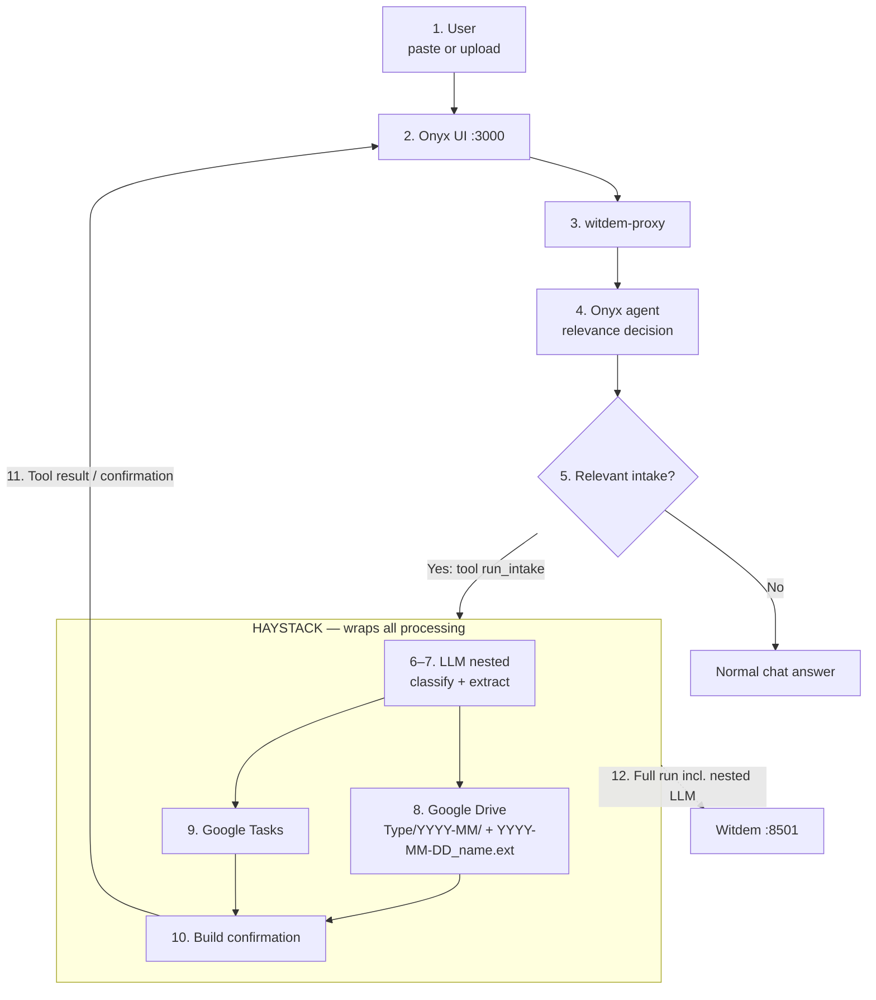

# Document Intake Agent — flow diagram brief

Copy this file into ChatGPT and ask it to draw a clear architecture / sequence diagram.

---

## Prompt for ChatGPT

Draw a clean English architecture flowchart for the system below.
Use simple boxes and arrows. Prefer landscape layout. Label every hop.
Do not invent extra components. Keep the style professional (product architecture slide).

### Visual layout (mandatory)

1. **Outside Haystack** (intake + decision boundary):
   - User
   - Onyx UI `:3000`
   - witdem-proxy (telemetry boundary; passes chat through)
   - **Onyx agent** decides relevance and may call tool `run_intake`
   These must **not** sit inside the Haystack rectangle.

2. **Decision diamond after Onyx:**
   - `Relevant intake?`
   - **No** → normal Onyx chat answer (stop; no Drive/Tasks)
   - **Yes** → Onyx calls custom tool `run_intake` → Haystack

3. **One large Haystack rectangle wraps ALL processing** after the tool call:
   - LLM classify + extract (nested)
   - Google Drive store
   - Google Tasks create
   - Build confirmation  
   Label: `Haystack pipeline — orchestrates processing (Witdem-instrumented)`

4. Confirmation returns to Onyx chat (via tool result / follow-up message).

5. Dashed arrow from the **Haystack rectangle** to Witdem:  
   `Full run (trace + outcomes)` — includes nested LLM as child spans.  
   Optionally also show Onyx chat turn in Witdem if proxy records it.

6. Do **not** draw a separate LLM → Witdem arrow.

7. **Every** document that enters Haystack goes to Google Drive:  
   `Type/YYYY/` + `YYYY-MM-DD-<Issuer>-invoice-<id>.ext` (document date; no month folder).

---

## Product

**Name:** Document Intake Agent (demo)

**User goal:** Paste text or upload a file into Onyx chat. **Onyx decides** whether the content is intake-relevant. If yes, it automatically runs intake (Drive + Tasks) via a tool. If no, normal chat.

User does not type special commands — they only paste/upload/talk. Onyx chooses when to act.

---

## Actors / components

| Component | Inside Haystack? | Role |
| --- | --- | --- |
| User | No | Pastes text or uploads PDF / Excel / image |
| Onyx UI (`:3000`) | No | Chat front-end |
| witdem-proxy | No | Pass-through + telemetry; does **not** blindly start intake |
| Onyx agent | No | Relevance decision; may call tool `run_intake` |
| Tool `run_intake` | Boundary | Starts Haystack with the message/file payload |
| Haystack pipeline | **Yes — outer wrap** | Classify → extract → Drive → Tasks → confirmation |
| LLM (in Haystack) | **Yes — nested** | Classify type + extract fields/tasks |
| Google Drive | **Yes — nested** | Store every intake document |
| Google Tasks | **Yes — nested** | Create open tasks |
| Witdem (`:8501`) | No (observer) | Audits Haystack root + nested spans (and Onyx turn via proxy) |

---

## Happy-path steps

**Outside Haystack — Onyx decides**

1. User pastes text or uploads PDF / Excel / image in **Onyx UI**.
2. Request goes through **witdem-proxy** to Onyx.
3. **Onyx agent** evaluates: is this intake-relevant (invoice, bureaucracy, document to file, open tasks)?
4. **If no** → normal chat answer. Stop.
5. **If yes** → Onyx calls custom tool **`run_intake`**.

**Inside the large Haystack box**

6. LLM classifies: `invoice` | `bureaucracy` | `other`.
7. LLM extracts fields + open tasks.
8. Store document in **Google Drive** — always for intake runs:
   - Folder: `Invoices|Documents|Other` / `YYYY/`
   - Filename: `YYYY-MM-DD-<Issuer>-invoice-<id>.<ext>` (invoices)
9. Create open items in **Google Tasks** (if any found).
10. Build confirmation (Drive path, tasks created).

**After Haystack**

11. Tool result / confirmation returns to **Onyx chat**.
12. **Witdem** shows the Haystack run (including nested LLM).

---

## Google Drive layout

```text
Google Drive/
├── Invoices/2026-09/2026-09-07_acme_invoice-1042.pdf
├── Documents/2026-09/2026-09-07_finanzamt_fristverlaengerung.pdf
└── Other/2026-09/2026-09-07_kostenuebersicht.xlsx
```

---

## Decision rule

| Who decides | What |
| --- | --- |
| **Onyx agent** | Whether content is intake-relevant → call `run_intake` or normal chat |
| **Haystack** | Type folder, filename, Drive write, Tasks, confirmation text |

| Content type (after tool) | Drive folder | Google Tasks | Confirmation |
| --- | --- | --- | --- |
| Invoice | `Invoices/YYYY-MM/` | If open items | Yes |
| Bureaucracy | `Documents/YYYY-MM/` | If open items | Yes |
| Other | `Other/YYYY-MM/` | If open items | Yes |

---

## Mermaid reference (match this structure)



---

## Caption

> User pastes or uploads in Onyx. witdem-proxy passes traffic through. Onyx decides relevance and calls `run_intake` only when needed. Haystack wraps all processing (LLM, Drive, Tasks, confirmation). Every intake document is stored under `Type/YYYY-MM/` with `YYYY-MM-DD_…` in the filename. Confirmation returns to chat. Witdem audits the Haystack root — LLM calls are nested child spans.

---

## Out of scope (do not draw)

- Proxy blindly starting Haystack on every message  
- Putting Onyx UI inside the Haystack box  
- Separate LLM → Witdem control path  
- Skipping Drive once intake has started  
- Manual user commands like “save now” (Onyx decides, user does not)  
- n8n, Slack, Notion, Jira  
- Mock Google Drive  
- Replacing Onyx or Haystack as platforms
